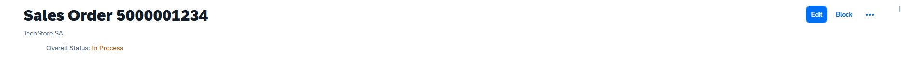
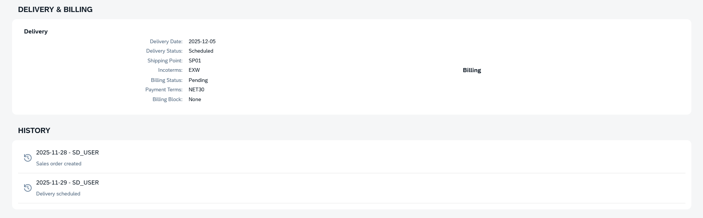

# UI5 Fiori Object Page Demo


A demo SAPUI5 application showcasing a complete **Fiori Object Page** for displaying Sales Order details.  
Includes structured sections, table bindings, formatters, header content, and status visualization.

> Part of a structured learning roadmap for the **SAP Certified Development Associate – SAP Fiori Application Developer** certification.

---

## 🧱 Technologies & Concepts Used

- **SAPUI5 / OpenUI5**
- **XML Views** (`App.view.xml`, `ObjectPage.view.xml`)
- **Object Page Floorplan**  
  (`sap.uxap.ObjectPageLayout`, `ObjectPageHeader`, `ObjectPageHeaderContent`)
- **JSON Models** (`JSONModel` + `/model/data.json`)
- **Data Binding**
  - Property binding
  - Aggregation binding (`Table`, `List`)
- **Custom Formatters** (`/model/formatter.js`)
  - Date formatting
  - Currency formatting
  - Quantity + Unit
  - Status → UI5 semantic state mapping (Success, Warning, Error, etc.)

---

## 📂 Project Structure

```text
ui5-fiori-object-page-demo
├─ webapp
│  ├─ controller
│  │  ├─ App.controller.js
│  │  └─ ObjectPage.controller.js
│  ├─ model
│  │  ├─ data.json          # Mock Sales Order data
│  │  ├─ models.js          # JSONModel loader
│  │  └─ formatter.js       # Formatters used in the view
│  ├─ view
│  │  ├─ App.view.xml       # Root <App> control
│  │  └─ ObjectPage.view.xml# Main Object Page view
│  ├─ Component.js
│  ├─ index.html
│  └─ manifest.json
└─ ui5.yaml
```

---

## ▶ Running the Project

### Requirements

- Node.js (20.x recommended)
- UI5 CLI

Install UI5 CLI:

```bash
npm install -g @ui5/cli
```

Install project dependencies:

```bash
npm install
```

Start the local development server:

```bash
npx ui5 serve -o index.html
```

The application will be available at:

**http://localhost:8080/index.html**

---

## 🧾 Features

- Full **Fiori Object Page** implementation
- Header content with:
  - Title
  - Subtitle
  - Action buttons
  - Overall Status badge using formatter
- Sections:
  - **General Information**
  - **Items Table**
  - **Delivery & Billing**
  - **History**
- Formatters for:
  - Currency (Intl.NumberFormat, locale `es-AR`)
  - ISO dates → local date format
  - Quantity + Unit
  - Status → Semantic UI5 State

---

## 🎯 Learning Objectives

This project demonstrates:

- How to create a structured SAPUI5 application
- Use of Fiori floorplans (Object Page)
- Working with JSON models
- Clean XML view development
- Custom formatters
- Data binding best practices

Useful for:

- Building a UI5 portfolio
- Practicing for the **Fiori Developer certification**
- Understanding real-world Fiori Object Page development patterns

---

## 🔍 Screenshots

### 🖼️ Screenshot 1 — Header & Overall Status


### 🖼️ Screenshot 2 — General Information & Items Table


### 🖼️ Screenshot 3 — Delivery, Billing & History

```
